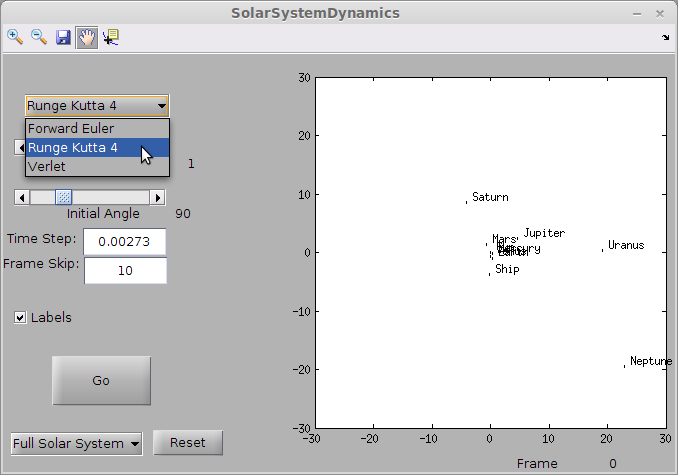
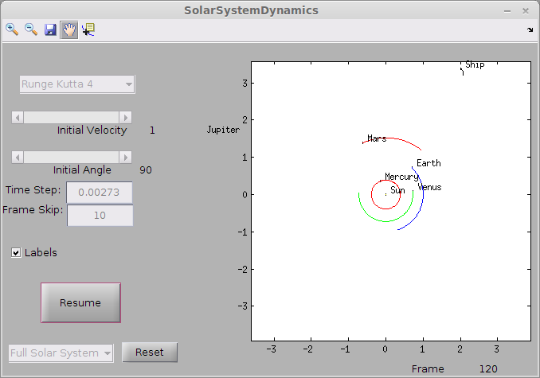

Orbits Notes:
=============

Development is done with Matlab R2013b on x64 Linux. 

Numeric Integration Methods
---------------------------
+ Forward Euler 
  * local error O(h2), global error O(h)
+ Runge-Kutta 4 
  * local error O(h5), global error O(h4)
+ Velocity Verlet 
  * local error in position O(h4), velocity O(h2)
  * global error in position O(h2), velocity O(h2)

Cool Features
-------------

+ The sun's initial momentum is initialized such that the system's initial net linear momentum is zero and its center of mass is stationary

+ Collisions are checked and absorptions are done based on mass with conservation of linear momentum

Plans
-----
+ Write a shooting method to solve the BVP (I'm here, I want to be there) and find the initial velocity for an unpowered (and powered?) object.

+ Include a graph of total kinetic energy and angular momentum over time to show which methods conserve which quantities

+ Figure out a better way to do initial conditions for the spacecraft

+ Shore up the hard-coded values for the planets

+ Improve the Euler method so it uses force-symmetry rather than recalculating

+ Include moons

Screenshots
-----------

